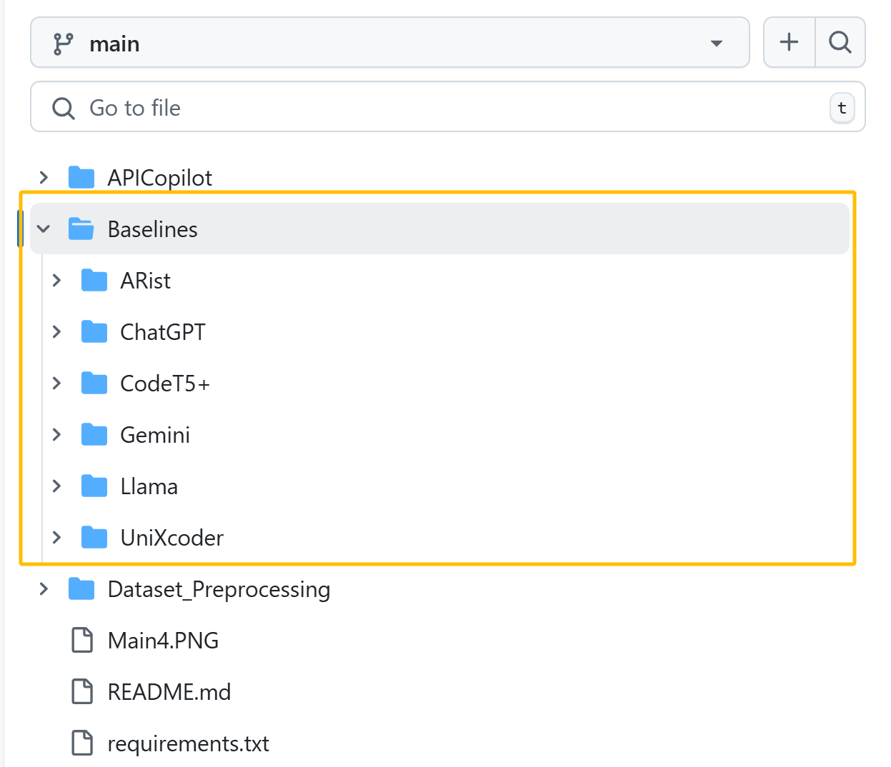
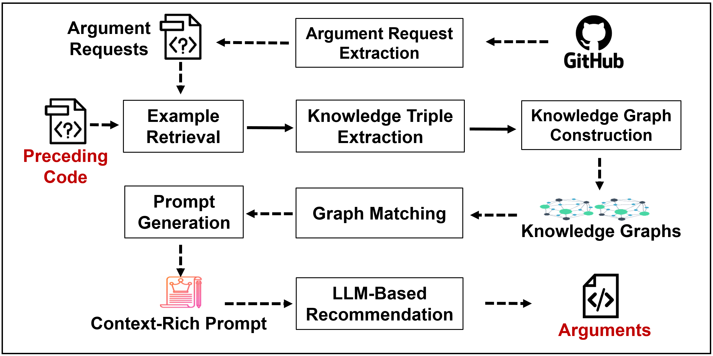

<p align="center">
  
</p>

#  _Replication Packages: LLM-based API Argument Completion with Knowledge-Augmented Prompts_
## 🚀 Overview 
This repository contains the code and resources necessary to reproduce the experimental results presented in the ICSE 2026 paper "LLM-based API Argument Completion with Knowledge-Augmented Prompts." Our paper introduces APICopilot, a novel approach that enhances LLM-based API argument completion using dynamically generated, context-rich prompts leveraging knowledge graphs and graph matching.
## 📜 Datasets
This project uses the following datasets:

📚 **Eclipse and Netbeans projects (Java):** These datasets were originally used in [cite the PARC paper]. Instructions on how to obtain and preprocess this dataset can be found [Netbeans](https://github.com/apache/netbeans/tree/54987ffb73ae9e17b23d4a43a23770142f93206b), [Eclipse](https://www.eclipse.org/downloads/download.php?file=/eclipse/downloads/drops4/R-4.17-202009021800/eclipse-platform-sources-4.17.tar.xz).

📚 **PY150 dataset (Python):** This dataset is publicly available at [(https://github.com/microsoft/CodeXGLUE/tree/main/Code-Code/CodeCompletion-token/dataset/py150)].
To use these dataset for code completion (API argument Completion task), run the preprocessing.py script to extract code files from the projects in this folder structure:
```text
📂 APICopilot/
├── 📂 Dataset_Preprocessing/
│   ├── 📜 Eclipse_preprocessing.py
│   └── 📜 Netbeans_Preprocessing.py
│   └── 📜 PY150_Preprocessing.py
```

📚 **Unseen Data (Java):** The unseen Java code was collected from projects and repositories published after October 2023, Due to size limits, the dataset has been uploaded to Google Drive. You can download the dataset using the following link:  [(https://drive.google.com/file/d/1QheSAfupFNCq_V4q4a4Mt8uHNDl_gpC2/view)].
The Unseen Java Data in this folder structure :
### Folder Structure
```plaintext
📂 dataset/
└── 📂 Unseen Dataset
       ├── 📜 CLdata
       ├── 📜 file1.java
       ├── 📜 file2.java
       └── ...  
``` 

Please ensure you have downloaded and preprocessed the datasets according to the provided instructions and place them in the appropriate directories as expected by the code.
# Baselines:
The implemenation source codes of applied baseline i.e. CodeT5+, UniXcoder, ARist, ChatGPT-4o, Gemini 2.0 Flash and Llama 3 70B for API argument completion are availabel in following folder structure:
<p align="center">
  
</p>

# Generated Prompts (To reproduce Results)
To make the results reproduceable without implementation of APICopilot. We have generated prompts i.e knowledge agumented prompts and few-shot prompts for ChatGPT, Gemini and Llama.
```text
📂 APICopilot/
├── 📂 GeneratedPrompts/
│   ├── 📜 APICopilotGeneratedPrompts.json
│   └── 📜 Few-ShotGeneratedPrompts.json
│   └── 📜 ARs_test.JSON
```
**APICopilotGeneratedPrompts.JSON:** Prompts generated using the APICopilot approach, leveraging knowledge triples and similar examples from an API usage graph to enhance argument prediction.
**Few-ShotGeneratedPrompts.JSON:** Prompts generated using a few-shot learning approach, providing relevant examples to guide argument prediction based on contextual similarities.
# APICopilot: Automated API Argument Completion Framework
<p align="center">
  
</p>
<p>
  
## 🚀 Overview of appraoch 
Given the preceding code with missing arguments, it retrieves similar code examples
and extracts knowledge triples from them. These triples are used
to construct KGs, and the approach leverages graph matching to
identify syntactically and semantically similar subgraphs. These
subgraphs and retrieved examples are incorporated into a prompt
for LLM that generates the suggested arguments.
</p>

## Class Hierarchy 
```
📦[APICopilot.Main]
├── [Preprocessing (Eclipse, NetBeans, PY150)]
├── [ARExtractor]
├── [ExampleRetriever]
├── [KnowledgeTripleExtractor]
├── [KnowledgeGraphBuilder]
├── [GraphMatcher]
├── [PromptGenerator]
└── [ArgumentRecommender]
```

### 🎯 Main Functions of Each Class

#### 1. **APICopilot**
- **`__init__(dataset_type, dataset_path, openai_api_key)`**: Initializes the framework with dataset and OpenAI API key.
- **`preprocess_dataset()`**: Preprocesses the dataset using the appropriate preprocessor.
- **`extract_argument_requests()`**: Extracts Argument Requests (ARs) from preprocessed data.
- **`retrieve_examples()`**: Retrieves similar examples for each AR.
- **`extract_knowledge_triples()`**: Extracts knowledge triples from ARs and examples.
- **`build_knowledge_graphs()`**: Builds knowledge graphs from knowledge triples.
- **`perform_graph_matching()`**: Performs graph matching to find similar subgraphs.
- **`generate_prompts()`**: Generates prompts for LLM-based argument completion.
- **`recommend_arguments()`**: Recommends arguments using LLM-based prediction.
- **`run_pipeline()`**: Runs the full APICopilot pipeline.

#### 2. **EclipsePreprocessing**
- **`preprocess()`**: Preprocesses Eclipse Java files.

#### 3. **NetBeansPreprocessing**
- **`preprocess()`**: Preprocesses NetBeans Java files.

#### 4. **PY150Preprocessing**
- **`preprocess()`**: Preprocesses PY150 Python files.

#### 5. **ARExtractor**
- **`extract_ar(preprocessed_data)`**: Extracts Argument Requests (ARs) from preprocessed data.

#### 6. **ExampleRetriever**
- **`retrieve_examples(ar)`**: Retrieves similar examples for a given AR.

#### 7. **KnowledgeTripleExtractor**
- **`extract_triples(ar)`**: Extracts knowledge triples from an AR.

#### 8. **KnowledgeGraphBuilder**
- **`build_g_input(ar_triples)`**: Builds the input knowledge graph.
- **`build_kg_examples(example_triples)`**: Builds the example knowledge graph.

#### 9. **GraphMatcher**
- **`find_isomorphic_subgraphs(kg_input, kg_examples)`**: Finds isomorphic subgraphs in the knowledge graphs.

#### 10. **PromptGenerator**
- **`generate_prompt(ar, matched_subgraphs)`**: Generates a prompt for LLM-based argument completion.

#### 11. **ArgumentRecommender**
- **`recommend_arguments(prompt)`**: Recommends arguments using LLM-based prediction.

## 🔄 Detailed Workflow of APICopilot

1. **Dataset Preprocessing**:
   - The dataset is preprocessed to clean and normalize the code files.
   - The preprocessed data is passed to the `ARExtractor`.

2. **Argument Request Extraction**:
   - The `ARExtractor` identifies method calls and extracts arguments.
   - The extracted ARs are passed to the `ExampleRetriever`.

3. **Example Retrieval**:
   - The `ExampleRetriever` retrieves similar examples for each AR.
   - The retrieved examples are passed to the `KnowledgeTripleExtractor`.

4. **Knowledge Triple Extraction**:
   - The `KnowledgeTripleExtractor` extracts knowledge triples from ARs and examples.
   - The extracted triples are passed to the `KnowledgeGraphBuilder`.

5. **Knowledge Graph Construction**:
   - The `KnowledgeGraphBuilder` constructs knowledge graphs from the triples.
   - The constructed graphs are passed to the `GraphMatcher`.

6. **Graph Matching**:
   - The `GraphMatcher` finds isomorphic subgraphs in the knowledge graphs.
   - The matched subgraphs are passed to the `PromptGenerator`.

7. **Prompt Generation**:
   - The `PromptGenerator` creates context-rich prompts for LLM-based argument completion.
   - The generated prompts are passed to the `ArgumentRecommender`.

8. **Argument Recommendation**:
   - The `ArgumentRecommender` uses the LLM to predict missing arguments.
   - The recommended arguments are returned to the `APICopilot` for final output.

## 📝 Example Usage

```python
# Initialize APICopilot with Eclipse dataset
api_copilot = APICopilot(
    dataset_type="eclipse",
    dataset_path="/path/to/eclipse/project",
    openai_api_key="your-openai-api-key"
)

# Run the full pipeline
api_copilot.run_pipeline()
## Prerequisites

Before running the APICopilot project, ensure you have the following installed:

### 1. **Python Version**
- Python 3.8 or higher is required. You can check your Python version by running:
  ```bash
  python --version
```
#### ⚙️ Dependencies
Install the required dependencies using pip:
```
pip install -r requirements.txt
```
#### 🔑 OpenAI API Key
APICopilot uses OpenAI's GPT-4o for argument recommendation. You need an OpenAI API key.
Set your API key as an environment variable:
```
export OPENAI_API_KEY="your-api-key-here"
```
#### Dataset
Download and prepare your dataset (Eclipse, NetBeans, or PY150).
Place the dataset in the appropriate directory and update the dataset_path in the code.
#### Hardware Requirements
A GPU is recommended for faster processing, especially for large datasets. Ensure you have at least 16GB of RAM for medium-sized projects.
#### Environment Setup
It is recommended to use a virtual environment to manage dependencies:
```
python -m venv apicopilot-env
source apicopilot-env/bin/activate  # On Windows: apicopilot-env\Scripts\activate
pip install -r requirements.txt
```

---

### 📚 Explanation of Prerequisites

1. **Python Version**: APICopilot uses modern Python features, so Python 3.8+ is required.
2. **Dependencies**: The `requirements.txt` file lists all necessary libraries for preprocessing, graph construction, LLM integration, and visualization.
3. **OpenAI API Key**: The project relies on OpenAI's GPT-4o for argument recommendation, so an API key is mandatory.
4. **Dataset**: The project supports Eclipse, NetBeans, and PY150 datasets. Ensure the dataset is properly formatted and placed in the correct directory.
5. **Hardware Requirements**: A GPU is recommended for faster processing, especially for large datasets or when using LLMs.
6. **Optional Tools**: Tools like Graphviz and JDK are optional but useful for visualization and Java parsing.
7. **Environment Setup**: Using a virtual environment ensures dependency isolation and avoids conflicts.
8. **Dataset Preprocessing**: The preprocessing scripts assume a specific directory structure for datasets.
9. **Testing**: Running tests ensures that all components are functioning correctly.

This setup ensures that users can easily install and run the APICopilot project on their local machines.
